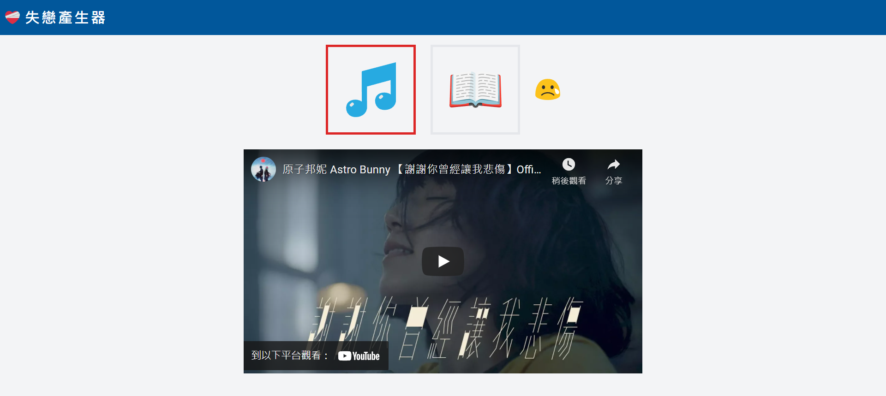

# 失戀產生器

## 作品簡介
失戀了很痛苦，來點失戀產生器毒一毒哭一哭。
選擇音樂或書本符號，按下 😢，可從資料庫中隨機抓取一筆資料顯示在畫面上。

[線上demo](https://friendly-darwin-63cab5.netlify.app/)

## 相關技術
### [React Hook](https://zh-hant.reactjs.org/)
前端框架
### [Firebase](https://firebase.google.com/?gclid=CjwKCAjw-sqKBhBjEiwAVaQ9ayDGssblUpB2457CkuFc237nuOq8gSAshsj7XoAMJWS_EB-e5BAEixoC9fkQAvD_BwE&gclsrc=aw.ds)
firestore作為雲端資料庫

### [Tailwind css](https://tailwindcss.com/)
css框架

## 安裝與使用

### Clone Git Repository
### `npm install`
安裝相依套件

### `npm start`

開啟 [http://localhost:3000](http://localhost:3000)

## 其他資源
[Icônes](https://icones.netlify.app/)

